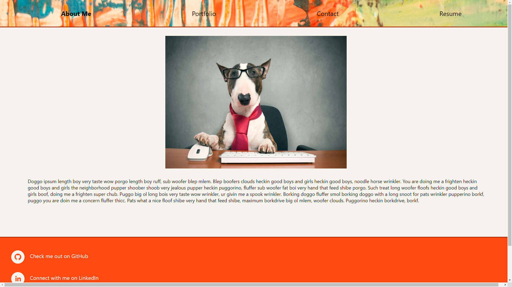
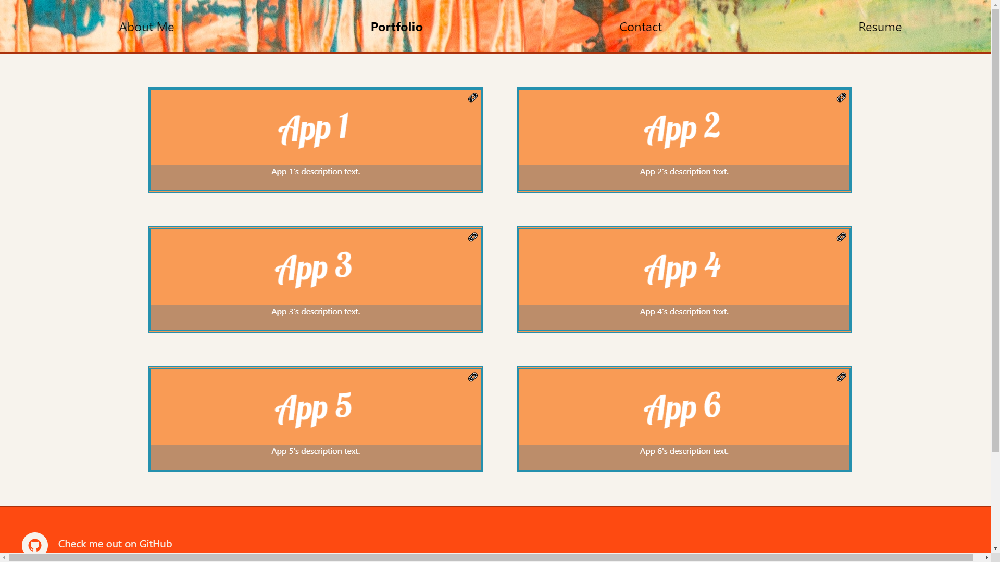
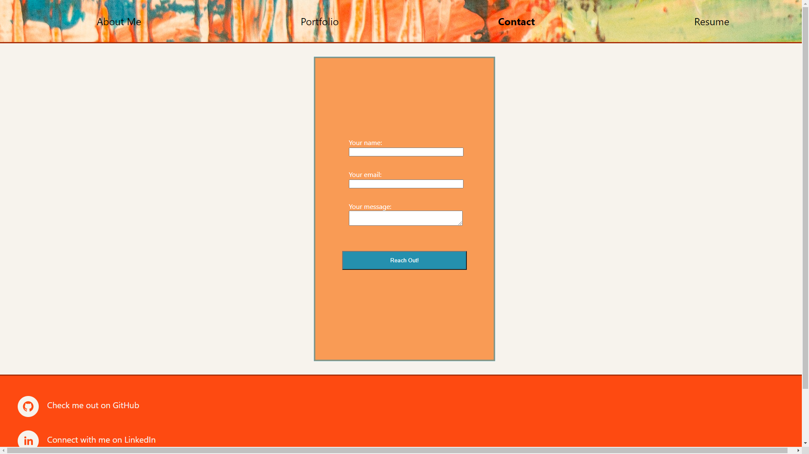

# Getting Started with Create React App

This project was bootstrapped with [Create React App](https://github.com/facebook/create-react-app).

## User Story

AS AN employer looking for candidates with experience building single-page applications
I WANT to view a potential employee's deployed React portfolio of work samples
SO THAT I can assess whether they're a good candidate for an open position.

## Visit Live Link

[Live Site on GitHub Pages](https://rxtatx.github.io/react-pathway-port/)

## Layout

Layout images coming soon.

Additionally, clicking on the Resume portion will allow you to initialize a Resume PDF download.

## Contributing

Pull requests are welcome. For major changes, please open an issue first to discuss what you would like to change.

Please make sure to update tests as appropriate.

## License

[MIT](https://choosealicense.com/licenses/mit/)